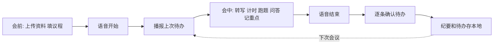
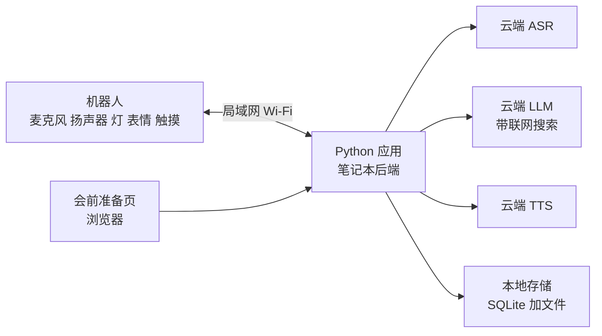

# 会议主持机器人 · 产品文档

2026-09-19 · AIWare

## 定位

放在会议室里的主持人机器人。会前读会议资料，会中全程听着攒上下文，控时间、管跑题，有人问它才回答，散会前追待办。会议纪要是副产品，不是卖点。

**痛点**：会议超时、跑题、一个人讲太久，人人都烦，但没人愿意开口打断，尤其对方是领导。会开完了，待办写在纪要里没人再看，下次开会又从头聊一遍。

**解法**：得罪人的事让机器人做。同一句“超时了”，桌宠形态的机器人说出来不尴尬。它在下次会议开场当着所有人的面说出上次谁还欠着什么。

**使用约束**：会中用户不碰电脑，只用语音、触摸和看灯。会前可以在一个网页上填议程、传资料。

配套的可视化蓝图见同目录的 `会议主持机器人_产品蓝图.html`。

机器人的名字待定，文中用 [名字] 代替。

## 为什么是硬件

软件的主场是会后，硬件的主场是会中。会中没人盯着电脑屏幕，软件干预不了会议过程；机器人在现场、有身体，所有人都看得见它。

飞书智能纪要已经有转写、总结、待办提取、责任人识别、任务同步和声纹识别。这些功能不和它比。

| 维度 | 会议软件 | 主持人机器人 |
| --- | --- | --- |
| 起作用的时间 | 会后 | 会中 |
| 超时和跑题 | 发通知，没人看 | 灯光变色、表情变化、当众开口 |
| 待办跟进 | 发给个人的任务通知 | 下次开场当众说出来，责任人拍背确认 |
| 启动方式 | 有人打开 App 点录制 | 一句话开始 |
| 记录归属 | 发起人的账号 | 会议室和项目 |
| 会中提问 | 自己翻资料、开浏览器搜 | 叫它，它从资料、本场转写、历史纪要、联网里找，两句话回答 |

**不能当卖点的**

- 隐私本地化：ASR 和 LLM 都在云端，音频已经出去了。只有换成本地模型后才成立，放路线图。
- 纪要质量：比不过大厂。
- “提效”：太泛。

被问到“飞书也能做”时的回答：功能层它都有，我们做的是它做不到的那一层，在场。

## 会议流程

一场会议分会前、开场、会中、结束四段，下一场的开场接上一场的待办，形成闭环。

**会前**

1. 打开会前准备页，填项目、议程和每个议题的时长、参会人。
2. 上传会议背景和资料：PDF、Word、Markdown、文本，或直接粘贴一段背景说明。
3. 后端提取文本存本地，和项目关联。不填也能开会，只是少了资料这一层。

**开场**

1. 说“[名字]，开始 XX 项目会议，30 分钟，三个议题”。项目名用来匹配会前准备的那场会议，时长和议程以准备页为准；没准备过就从这句话里提取，提取不到项目名用会议室默认项目。
2. 启动人脸跟随，转向人，提示会议开始。
3. 读取该项目未完成的待办并播报。

**会中**

1. 转写：全程录音，按句转成文字，攒成本场会议的上下文。
2. 计时：底部灯显示进度，绿到黄到红。议题或总时长超时，表情变化加语音提醒。
3. 跑题：每 30 秒把最近的转写和议程交给 LLM 判断。第一次只做表情，连续两次才开口。
4. 问答：说“[名字]，……”提问。播放思考动画，按会议资料、本场转写、历史纪要、联网搜索的顺序找答案，两句话内回答并说明来源。用户明说“查一下”时直接联网。它不主动插话。
5. 记重点：说“[名字]，记下这个重点”。点头确认，不出声。

**结束**

1. 说“[名字]，会议结束”，拍背作为备份。
2. 逐条复述待办：“张三，周五前给出报价，对吗？”责任人拍背确认。
3. 口头播报：“3 条结论，4 条待办，已保存。”
4. 纪要和待办写入本地。

## 功能范围与优先级

P0 在前 1.5 小时内必须跑通，P1 是演示需要的，P2 有时间再做。

| 优先级 | 功能 | 说明 |
| --- | --- | --- |
| P0 | 语音开始和结束 | 在转写文本里匹配 [名字] 加指令词 |
| P0 | 议程计时和灯光进度 | 不依赖 ASR 质量，最稳 |
| P0 | 超时提醒 | 表情加语音 |
| P0 | 实时转写 | 按音量做静音切句，每句送一次 ASR，全程累积为本场上下文 |
| P0 | 资料上传入口 | 会前准备页：项目、议程、参会人、背景和资料文件 |
| P0 | 被问到时回答 | 上下文为资料、本场转写、历史纪要，不够再联网；带思考动画，两句话内回答并说明来源 |
| P1 | 跑题判断 | 先表情，连续两次才开口 |
| P1 | 拍背确认待办 | 结束前逐条复述 |
| P1 | 出纪要并存本地 | 结论、待办、未决问题、重点 |
| P1 | 开场播报上次待办 | 体现记忆的唯一环节，时间紧也要保住 |
| P2 | 音量降温 | 音量持续偏高时做缩头动作 |
| P2 | 举手示意 | 判断有可查证的争议时只抬头亮灯，被点名才说 |
| P2 | 飞书群推送 | 群自定义机器人 webhook |
| P2 | 拍白板 | 需先停人脸跟随，再转头拍照 |

**不做**

- 说话人分离、声源定位、声纹。待办归属靠话里出现的名字，由 LLM 提取。
- 权限和账号。
- 扫码参会页。会前准备页只给组织者用，不做参会人登录。
- 资料里的图片和扫描件识别。只处理能提取出文本的文件。
- 向量检索。历史纪要直接塞进 LLM 上下文，本地数据库作备选。
- 主动纠错、主动发表意见。
- 本地 ASR 和本地 LLM。

## 交互设计

每个状态都同时有灯光和表情两种反馈，所有人不看屏幕也知道机器人在做什么。行为 ID 来自 SDK 仓库的设备状态目录，随固件版本变化，到场核对。

| 状态 | 触发 | 表情行为 | 灯光 | 语音 |
| --- | --- | --- | --- | --- |
| 会议开始 | “[名字]，开始…会议” | `listening` | 侧灯常亮，底灯绿 | 提示开始，播报上次待办 |
| 时间过半 | 计时器 | 无 | 底灯黄 | 无 |
| 超时 | 计时器 | `shock` | 底灯红，`blink` | “这个议题超时了” |
| 跑题第一次 | LLM 判断 | `speechless` | 不变 | 无 |
| 跑题连续两次 | LLM 判断 | `agent_question` | 侧灯 `breathing` | “这个要不要会后聊” |
| 找答案中 | “[名字]，……”提问 | `thinking` | 侧灯 `status_pulse` | 无 |
| 回答 | 找到答案或确认找不到 | `speaking` | 侧灯常亮 | 两句话加来源；找不到就说找不到 |
| 记重点 | “[名字]，记下这个重点” | 点头（俯仰动作） | 侧灯闪一次 | 无 |
| 确认待办 | 会议结束 | `agent_question` | 侧灯 `breathing` | 逐条复述 |
| 待办已确认 | 背部触摸 | `happy` | 侧灯绿闪 | 无 |
| 音量过高 | 音量持续超阈值 | `sad` 加低头 | 不变 | 无 |

**规则**

- 会中的反馈优先用表情和灯光，不出声。机器人说话会打断会议，声音也会被自己的麦克风录进去。
- 播报期间暂停指令匹配。
- 回答不超过两句话。细节存到纪要里。
- 灯区只有 `side` 和 `bottom`。`bottom` 固定显示时间进度，`side` 显示状态。麦克风和摄像头的隐私指示灯由固件控制，应用不能改。
- 触摸是所有语音指令的备份：背部触摸用于确认和结束，滚轮用于调整时长。

## 技术方案

应用是一个 Python 程序，跑在电脑上，通过 SDK 的 Runtime 经局域网控制机器人。演示时笔记本合上放一边当后端。在 SDK 仓库的 `examples/first_meeting` 上改，它已经跑通了 STT、TTS、LLM、人脸跟随和表情封装。

**SDK 接口对应**（来自 SDK 仓库源码：https://github.com/orulink-ai/WatcheRobot_python_sdk ）

| 能力 | 接口 | 要点 |
| --- | --- | --- |
| 麦克风 | `robot.microphone.open_pcm()` | 16 kHz 单声道 16 位 PCM，每帧 60 ms |
| 播放 | `robot.audio.play_pcm()` / `play_file()` | 默认 24 kHz 16 位单声道，单次上限 4 MiB，约 87 秒 |
| 表情行为 | `robot.behavior.play(id, repeat=1)` | 返回 Job，用 `job.wait()` 等完成 |
| 云台 | `robot.motion.move_to()` / `set_target(pan_deg, tilt_deg)` | 点头、低头用 |
| 灯光 | `robot.lights.set_color()` / `play_effect()` / `off()` | 区域 `side`、`bottom`、`all`；灯效 `blink`、`breathing`、`rainbow`、`status_pulse` |
| 输入 | `input.wait(timeout)` | 背部触摸、屏幕点击、滚轮 |
| 人脸跟随 | `robot.face_tracking.start()` / `stop()` | 首次启动约 6 秒；需固件能力 `face_tracking.control.v1`；与拍照互斥 |
| 拍照 | `robot.camera.capture()` | 拍前必须先停跟随 |
| 能力检查 | `robot.supports(name)` / `robot.capabilities` | 启动时检查，缺失的功能自动降级 |

**开发约束**

- Python 3.10 到 3.12。
- 必须用 `watcherobot app run` 启动，不能直接 `python app.py`。
- SDK 调用是阻塞的，统一包在 `asyncio.to_thread` 里。
- 第三方依赖写进 `app.json` 的 `dependencies`。

**语音链路**

1. 从麦克风读 PCM 帧，按音量做静音切句。
2. 每句送一次云端 ASR，得到文本。
3. 文本追加到会议转写，同时匹配 [名字] 和指令词。
4. 指令延迟约 1 到 2 秒。不接持续流式接口。

**会前准备页**

- 由后端程序提供的网页。SDK 支持应用自带网页界面，`examples/first_meeting` 里有现成的本地网页控制台可以改。
- 默认只监听本机。要让手机上传，改为监听局域网地址，机器人屏幕或终端里显示访问地址。
- 文本提取：PDF 用 pypdf，Word 用 python-docx，Markdown 和文本直接读。提取结果存本地文本文件。
- 单场资料总量设上限，建议 3 万字。超出时上传阶段先让 LLM 压缩成摘要，原文保留。
- 从资料里抽取专有名词（型号、人名、公司名），供应方支持的话作为 ASR 热词。

**上下文与问答**

- 本场上下文由三部分拼成：会议资料文本、本场转写、该项目历史纪要。三者都直接塞进 LLM 上下文，不做向量检索。
- 提问时的查找顺序：会议资料，本场转写，历史纪要，联网搜索。提示词要求回答里标明来源属于哪一层，找不到就说找不到。
- 转写太长时，只保留最近 15 分钟的原文，更早的部分每 10 分钟压缩一次摘要。

**云服务**：ASR、TTS、LLM 的供应方自选，替换示例代码里的 URL 和 API key。LLM 需要支持联网搜索。TTS 备选是 `examples/dshtts_speaker` 里的 edge-tts，不需要 key。

**LLM 调用点**

| 调用 | 时机 | 输入 | 输出 |
| --- | --- | --- | --- |
| 解析开场 | 会议开始 | 开场那句话 | 项目名、时长、议题数 |
| 跑题判断 | 每 30 秒 | 议程加最近转写 | 是或否 |
| 问答 | 被点名 | 问题、会议资料、本场转写、历史纪要；需要时开联网搜索 | 两句话加来源层级 |
| 资料压缩 | 上传时，仅超长才触发 | 资料全文 | 摘要 |
| 出纪要 | 会议结束 | 完整转写、重点标记、会议资料、该项目历史纪要 | 结论、待办、未决问题的 JSON |

**本地存储**

- SQLite 一张待办表：项目、负责人、内容、截止时间、状态、来源会议、是否已确认。开场播报是精确查询。
- 纪要存 JSON 文件，转写存文本文件，按项目和日期命名。
- 会前准备的内容存一份 JSON：项目、议程、参会人、资料文件列表。资料原件和提取出的文本按会议存放。
- 历史纪要直接塞进 LLM 上下文。会议数量多了再换向量检索，届时用 Chroma 加 bge-small-zh，按纪要条目切块。

## 风险与应对

最大的风险是现场网络和语音识别，两者都要有不依赖它们的备用路径。

| 风险 | 影响 | 应对 |
| --- | --- | --- |
| 现场 Wi-Fi 有设备隔离 | 电脑连不上机器人 | 带手机热点，电脑和机器人都连它 |
| SDK 版本和固件不匹配 | 人脸跟随、输入事件可能不可用 | 到场先问主办方对应版本。指南写 0.1.1，PyPI 最新 0.1.10，示例要 0.1.9 |
| 现场嘈杂，ASR 听错 | 指令不触发或误触发 | 名字选 ASR 识别稳的；所有语音指令都有触摸备份；准备预录音频直接灌进管线 |
| 机器人听到自己的声音 | 误触发指令，转写里混入播报 | 播报期间暂停指令匹配。设备有回声消除，但普通麦克风路径是否生效未确认 |
| 跑题判断误报 | 烦人 | 阈值设高，先表情后开口，连续两次才说话 |
| 查证延迟 5 到 10 秒 | 冷场 | 播放 `thinking` 和灯效，让人知道它在查 |
| 音频组合能力有边界 | 某些能力不能同时用 | SDK 指南提醒不要从接口存在推断组合可用。麦克风、播放、跟随同时用在示例里已验证；跟随加拍照不行 |
| 资料太长或解析失败 | 上下文超限，回答变慢或报错 | 设字数上限，超长先压缩；解析失败在准备页上明确提示，允许改为粘贴文本 |
| 问答答非所问 | 当众出错，失去信任 | 要求标明来源；找不到就说找不到；回答限两句话，减少胡说的空间 |
| 云服务 key 或额度出问题 | 整条链路断 | TTS 备 edge-tts；ASR 和 LLM 各备一个供应方 |

## 演示脚本与时间分配

演示一场约 3 分钟的模拟会议，五个反应，每个都用到机器人的身体。上一场会议的待办和本场的资料提前准备好，现场先展示准备页，再从“开场追待办”演起。

**演示脚本**

1. 开场：“[名字]，开始报价项目会议，两分钟，两个议题。”机器人转头，播报：“上次遗留一项：张三的供应商报价还没结。”
2. 问资料：“[名字]，资料里 A 家的交期是多少？”机器人思考后回答，并说出来自哪份文件。
3. 跑题：两个人故意聊午饭。机器人先做无语表情，再开口：“这个要不要会后聊。”
4. 联网查：两人争一个资料里没有的事实。“[名字]，查一下 X。”机器人歪头思考，两句话回答。
5. 超时：底灯变红，机器人提醒超时。
6. 结束：“[名字]，会议结束。”机器人逐条复述待办，责任人拍背确认，播报已保存。

**3 小时分配**

| 时间 | 任务 |
| --- | --- |
| 0:00 到 0:30 | 问清 SDK 版本，配网配对，跑通 `hello_robot` 和 `first_meeting`，打印能力清单，测候选名字 |
| 0:30 到 1:30 | P0：切句转写、指令匹配、计时和灯光、超时提醒、准备页和资料提取、问答 |
| 1:30 到 2:30 | P1：跑题判断、出纪要、存本地、开场播报、拍背确认 |
| 2:30 到 3:00 | 只排练，不加功能。录一段备用音频 |

**分工建议**（三人）：一人负责语音链路和指令匹配，一人负责机器人反馈（灯光、表情、计时、触摸），一人负责准备页、资料提取、LLM 提示词、问答、纪要和存储。

## 路线图

黑客松之后按“先补会中能力，再做混合会议，最后做本地化”的顺序走。

| 阶段 | 内容 | 前提 |
| --- | --- | --- |
| 一 | 站会模式：每人限时，灯光倒计时，到时转向下一个人 | 无，不依赖 ASR |
| 一 | 在场感知：人到齐提示开始，人走光自动结束 | 人脸检测可用 |
| 一 | 发言均衡：谁说太多、谁没开口 | 说话人分离或声源定位 |
| 二 | 远程参会者的替身：远程端点“我要发言”，机器人替他举手；远程控制机器人转头看白板 | 远程端网页 |
| 二 | 接入飞书、企微、钉钉：待办写进任务系统，机器人只做会议室里的入口和出口 | 各平台开放接口 |
| 三 | 本地 ASR 和本地 LLM，数据不出会议室 | 后端换成带算力的小盒子；候选 FunASR、sherpa-onnx |
| 三 | 权限：指定的人可以语音提取纪要 | 声纹或账号体系 |
| 三 | 后端脱离笔记本，做成会议室常驻的小盒子 | 硬件选型 |

第二阶段的远程替身是最接近完整产品的方向：会议软件服务线上的人，会议室硬件服务线下的人，混合会议中间那层没人做好。

第三阶段完成后，隐私本地化才可以当卖点讲，面向禁用云端会议记录的公司。

## 待确认事项

**到场前**

- [ ] 选定 ASR、TTS、LLM 供应方，拿到 API key，确认 LLM 的联网搜索参数和上下文长度
- [ ] 准备一份演示用的会议资料（两三页的 PDF）和一条上次的待办
- [ ] 电脑上有 Python 3.10 到 3.12 的环境
- [ ] 克隆 SDK 仓库，读 `examples/first_meeting/meeting/` 下的 `service.py` 和 `cloud.py`
- [ ] 手机热点可用

**到场后**

- [ ] 现场设备固件对应哪个 SDK 版本
- [ ] `robot.capabilities` 里是否有人脸跟随、触摸输入、实时麦克风
- [ ] 设备上实际可用的行为 ID，核对交互表
- [ ] 普通麦克风路径下回声消除是否生效
- [ ] 机器人名字：几个候选各对着 ASR 测十遍，选识别最稳的

**未决问题**

- 机器人叫什么
- 团队人数和分工
- 单独立项后的目标用户：自用、小团队，还是面向企业会议室
